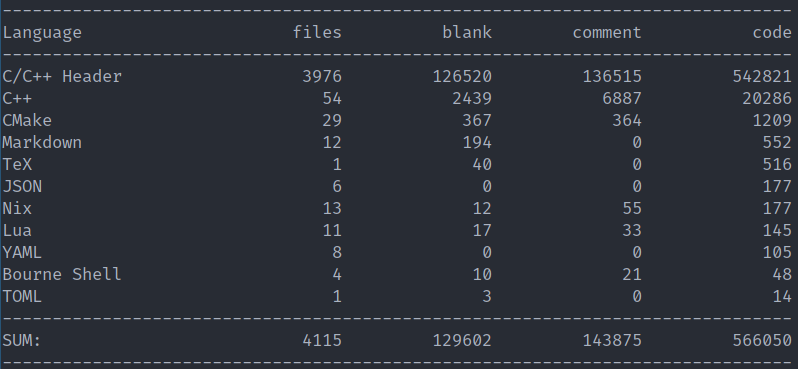

# d-SEAMS

**Deferred Structural Elucidation Analysis for Molecular Simulations**

[](https://github.com/d-SEAMS/seams-core/actions/workflows/ci_test.yml)
[](https://builtwithnix.org)


- Check our build status [here](https://github.com/d-SEAMS/seams-core/actions/workflows/).
- The docs themselves are [here](https://docs.dseams.info) and development is
  ongoing [on GitHub](https://github.com/d-SEAMS/seams-core)
- We also have [a Zenodo community](https://zenodo.org/communities/d-seams/) for user-contributions like reviews, testimonials
  and tutorials
- Trajectories are hosted [on
  figshare](https://figshare.com/projects/d-SEAMS_Datasets/73545).
- Our [wiki is here](https://wiki.dseams.info)

\brief The C++ core of d-SEAMS, a molecular dynamics trajectory analysis engine.

This repository is the C++ engine (`libyodaLib`) and the `seams` CLI.

```bash
seams read water.lammpstrj
seams chill-plus water.lammpstrj --cutoff 3.5
seams cages water.lammpstrj
```

Scripting front ends are separate packages:

- Python: `pydseams` ([PydSEAMSlib](https://github.com/d-SEAMS/PydSEAMSlib))
- Lua/Fennel: `dseams` ([yodaStruct](https://github.com/d-SEAMS/yodaStruct))

Build with `pixi run setup && pixi run build && pixi run test`, or with
the Nix flake: `nix build` and `nix develop`.

\note The <a href="pages.html">related pages</a> describe the examples and how to obtain
the data-sets (trajectories) <a
href="https://figshare.com/projects/d-SEAMS_Datasets/73545">from figshare</a>.

\warning The live builds are `pixi` + meson, or the Nix flake. The
CMake-era `yodaStruct` derivation is gone. Manage compiler and library
versions yourself if you do not use `pixi`, `nix`, or the `conda`
environment.

# Citation

- This has been published at the [Journal of Chemical Information and Modeling
  (JCIM)](https://doi.org/10.1021/acs.jcim.0c00031)

- You may also read [the preprint on arXiv](https://arxiv.org/abs/1909.09830)

If you use this software please cite the following:

    Goswami, R., Goswami, A., & Singh, J. K. (2020). d-SEAMS: Deferred Structural Elucidation Analysis for Molecular Simulations. Journal of Chemical Information and Modeling. https://doi.org/10.1021/acs.jcim.0c00031

The corresponding `bibtex` entry is:

    @Article{Goswami2020,
    author={Goswami, Rohit and Goswami, Amrita and Singh, Jayant Kumar},
    title={d-SEAMS: Deferred Structural Elucidation Analysis for Molecular Simulations},
    journal={Journal of Chemical Information and Modeling},
    year={2020},
    month={Mar},
    day={20},
    publisher={American Chemical Society},
    issn={1549-9596},
    doi={10.1021/acs.jcim.0c00031},
    url={https://doi.org/10.1021/acs.jcim.0c00031}
    }

# Compilation

We use a deterministic build system to generate both bug reports and uniform
usage statistics. The Lua and Fennel CLI is
[yodaStruct](https://github.com/d-SEAMS/yodaStruct); the functions it
registers are documented
[there](https://github.com/d-SEAMS/yodaStruct/blob/main/docs/luaFunctions.md).

We also provide a `conda` environment as a fallback, which is also recommended for MacOS users.

## Build

### Conda

For MacOS systems without Nix, the following instructions may be more
suitable. We will assume the presence of [micromamba](https://mamba.readthedocs.io/en/latest/installation.html):

```bash
cd ~/seams-core
micromamba create -f environment.yml
micromamba activate dseams
luarocks install luafilesystem
```

Now the installation can proceed. The commands below that invoke
`yodaStruct` belong in a
[yodaStruct](https://github.com/d-SEAMS/yodaStruct) checkout. This
repository builds `libyodaLib`.

\note we do not install `lua-luafilesystem` within the `conda` environment because it is outdated on `osx`

```bash
mkdir build
cd build
export EIGEN3_INCLUDE_DIR=$CONDA_PREFIX/include/eigen3
cmake -DCMAKE_BUILD_TYPE=Release -DCMAKE_EXPORT_COMPILE_COMMANDS=YES -DCMAKE_INSTALL_PREFIX:PATH=$CONDA_PREFIX ../
make -j$(nproc)
make install
LD_LIBRARY_PATH=$LD_LIBRARY_PATH:$CONDA_PREFIX/lib $CONDA_PREFIX/bin/yodaStruct -c lua_inputs/config.yml
```

We have opted to install into the `conda` environment, if this is not the
intended behavior, use `/usr/local` instead.

### Spack (not working at the moment)

Manually this can be done in a painful way as follows:

```bash
spack install eigen@3.3.9 lua@5.2
spack install catch2 fmt yaml-cpp openblas boost cmake ninja meson
spack load catch2 fmt yaml-cpp openblas boost cmake ninja meson eigen@3.3.9 lua@5.2
luarocks install luafilesystem
```

Or better:

```bash
spack env activate $(pwd)
# After loading the packages
luarocks install luafilesystem
```

Now we can build and install as usual.

```bash
cmake -S . -B build -DCMAKE_BUILD_TYPE=RelWithDebInfo \
 -DCMAKE_EXPORT_COMPILE_COMMANDS=YES -GNinja \
 -DCMAKE_INSTALL_PREFIX=$HOME/.local \
 -DCMAKE_CXX_FLAGS="-pg -fsanitize=address " \
 -DCMAKE_EXE_LINKER_FLAGS=-pg -DCMAKE_SHARED_LINKER_FLAGS=-pg \
 -DBUILD_TESTING=NO
cmake --build build
```

Or more reasonably:

```bash
export INST_DIR=$HOME/.local
cd src
meson setup bbdir --prefix $INST_DIR
meson compile -C bbdir
meson install -C bbdir
# if not done
export PATH=$PATH:$INST_DIR/bin
export LD_LIBRARY_PATH=$LD_LIBRARY_PATH:$INST_DIR/lib
cd ../
yodaStruct -c lua_inputs/config.yml
```

### Nix

The flake builds `libyodaLib` and the `seams` CLI with meson. Optional
backends that meson would otherwise wrap-git (vesin, readcon-core) or
that nixpkgs does not ship (chemfiles) stay off unless a package is
already in the closure.

```bash
nix build                  # ./result/bin/seams
nix run . -- read input/traj/exampleTraj.lammpstrj
nix develop                # compiler, Eigen, BLAS, Catch2, gdb
nix flake update           # refresh the nixpkgs pin
nix fmt
```

`nix build` runs the Catch2 suite. The Lua library is
[yodaStruct](https://github.com/d-SEAMS/yodaStruct); Python is
[PydSEAMSlib](https://github.com/d-SEAMS/PydSEAMSlib). Those
repositories have matching flakes.

The [dseams Cachix](https://dseams.cachix.org/) cache is optional:

```bash
nix-env -iA cachix -f https://cachix.org/api/v1/install
cachix use dseams
```

### Usage

```bash
seams read input/traj/exampleTraj.lammpstrj
seams chill-plus input/traj/exampleTraj.lammpstrj --cutoff 3.5
seams cages input/traj/exampleTraj.lammpstrj
```

Lua scripts live in the [yodaStruct](https://github.com/d-SEAMS/yodaStruct)
checkout (`require("dseams")`). Paths in those examples are relative to
the directory you invoke them from.

### Language Server Support

```bash
nix develop
meson setup bbdir -Dwith_tests=true
ln -s bbdir/compile_commands.json .
```

**Do Not** commit `compile_commands.json`.

## Development

```bash
nix develop
meson setup bbdir -Dwith_tests=true
meson compile -C bbdir
meson test -C bbdir
```

# Running

```bash
nix build
./result/bin/seams --help
./result/bin/seams --frame 1 --last 100 --jobs 8 --type 1 --graph seeded cages dump.lammpstrj
./result/bin/seams --graph cutoff cages dump.lammpstrj
./result/bin/seams --graph knn cages dump.lammpstrj
```

To run the sample inputs, stay in the repository root so `input/` is a
child directory.

## Tests

```bash
nix build          # meson test is the install check
nix develop --command meson test -C bbdir
```

# Developer Documentation

The flake pins nixpkgs. To move the pin:

```bash
nix flake update nixpkgs
```

Then `nix build` from the project root. Outputs land in `./result`.

## Leaks and performance

While testing for leaks, use `clang` (for
[AddressSanitizer](https://github.com/google/sanitizers/wiki/AddressSanitizer)
and
[LeakSanitizer](https://github.com/google/sanitizers/wiki/AddressSanitizerLeakSanitizer))
and the following:

```{bash}
# From the developer shell
export CXX=/usr/bin/clang++ && export CC=/usr/bin/clang
cmake .. -DCMAKE_CXX_FLAGS="-pg -fsanitize=address " -DCMAKE_EXE_LINKER_FLAGS=-pg -DCMAKE_SHARED_LINKER_FLAGS=-pg
```

# Overview

As of Mon Jan 20 15:57:18 2020, the lines of code calculated by
[cloc](http://cloc.sourceforge.net/) are as follows:



# Contributing

Please ensure that all contributions are formatted according to the
[clang-format](./clang-format) configuration file.

Specifically, consider using the following:

- [Sublime Plugin](https://github.com/rosshemsley/SublimeClangFormat) for users
  of Sublime Text

- [format-all](https://github.com/lassik/emacs-format-all-the-code) for Emacs
- [vim-clang-format](https://github.com/rhysd/vim-clang-format) for Vim
- Visual Studio: http://llvm.org/builds/, or use the [integrated support in Visual Studio 2017](https://blogs.msdn.microsoft.com/vcblog/2018/03/13/clangformat-support-in-visual-studio-2017-15-7-preview-1/)
- Xcode: https://github.com/travisjeffery/ClangFormat-Xcode

Where some of the above suggestions are derived from [this depreciated githook](https://github.com/andrewseidl/githook-clang-format).

Also, do note that we have a `CONTRIBUTING` file you **need to read** to
contribute, for certain reasons, like, common sense.

## Commit Hook
Note that we expect compliance with the `clang-format` as mentioned above, and this may be enforced by using the provided scripts for a pre-commit hook:
```bash
./scripts/git-pre-commit-format install
```

This will ensure that new commits are in accordance to the `clang-format` file.

## Development Builds

```bash
nix develop
meson setup bbdir -Dwith_tests=true
meson compile -C bbdir
./bbdir/src/seams read input/traj/exampleTraj.lammpstrj
gdb --args ./bbdir/src/seams read input/traj/exampleTraj.lammpstrj
```

To load debugging symbols from the shared library inside `gdb`:

```bash
add-symbol-file bbdir/src/libyodaLib.so
```

Then you can set breakpoints in the C++ code; for instance:

```bash
b seams_input.cpp:408
```

# Acknowledgements

The following tools are used in this project:

- [CMake](https://cmake.org/) for compilation ([cmake-init](https://github.com/cginternals/cmake-init) was used as a reference)
- [Clang](https://clang.llvm.org/) because it is more descriptive with better tools
- [Doxygen](https://www.doxygen.org) for the developer API
- [clang-format](https://clang.llvm.org/docs/ClangFormat.html) for code formatting
  - [clang-format-hooks](https://github.com/barisione/clang-format-hooks) for `git` hooks to enforce formatting
- [lua](https://www.lua.org) for the scripting engine
- [yaml](http://yaml.org/) for the configuration

## Third Party Libraries

The libraries used are:

- [backward-cpp](https://github.com/bombela/backward-cpp) for better stacktraces without `gdb`
- [Argum](https://github.com/gershnik/argum) for the `seams` CLI (same parser as eonclient; colors, `NO_COLOR`)
- [cxxopts](https://github.com/jarro2783/cxxopts) for the Catch2 test harness
- [rang](https://github.com/agauniyal/rang) for terminal styles (ANSI)
- [sol2](https://github.com/ThePhD/sol2) for interfacing with lua
- [yaml-cpp](https://github.com/jbeder/yaml-cpp) for working with `yaml`
- [fmt](https://github.com/fmtlib/fmt) for safe and fast formatting
- [Linear Algebra PACKage (LAPACK)](http://www.netlib.org/lapack/)
- [Basic Linear Algebra Subprograms (BLAS)](http://www.netlib.org/blas/)
- [Spectra](https://github.com/yixuan/spectra/)
- [Boost Geometry](https://www.boost.org/doc/libs/1_68_0/libs/geometry/doc/html/index.html) for working with different coordinates
- [Boost Math](https://www.boost.org/doc/libs/?view=category_math) for spherical harmonics
- [Blaze](https://bitbucket.org/blaze-lib/blaze/) for very fast modern linear algebra
- [nanoflann](https://github.com/jlblancoc/nanoflann) to calculate nearest neighbors
- [icecream-cpp](https://github.com/renatoGarcia/icecream-cpp) for pretty-printing and debugging
